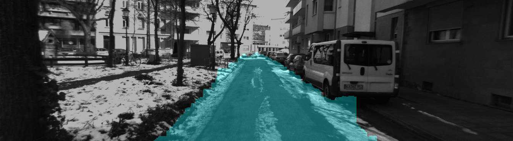

# GroundEstimation

## Description 
C++ code for ground(traversable) region estimation using stereo images.

## Dependencies
-   Opencv 3.x: follow the instructions on http://opencv.org/ or install via

## Dataset
We use KITTI dataset for experiment. For example, https://s3.eu-central-1.amazonaws.com/avg-karlsruhe/2010_03_09_drive_0019.zip 

## Build
-   Clone this repo:
```
git clone https://github.com/RichardChe/GroundEstimation.git 
cd GroundEstimation
```
- Change the directory for OpenCV3 in CMakeLists.txt according to your OpenCV setup
- In include/Config.h, change imageDir according to your image location
```
mkdir build && cd build
cmake ..
make
```

## Run
-   In build folder:
```
./GroundEstimation
```

